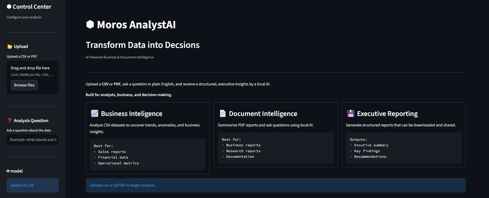
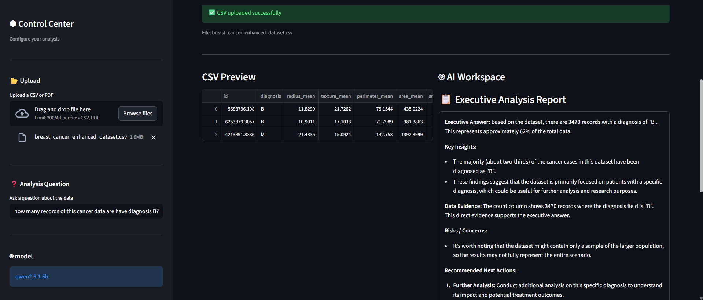
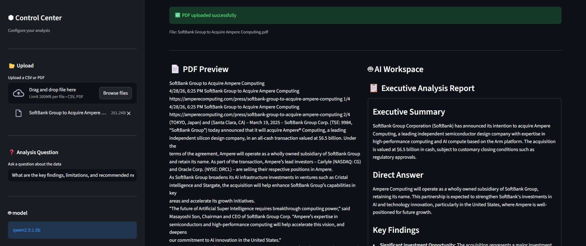

# ⬢ Moros AnalystAI

Transform Data into Decisions.

AI-Powered Business & Document Intelligence



AnalystAI is a local AI-powered data analysis tool that transforms CSV files into structured business insights using Streamlit and Ollama.

It allows users to upload datasets, ask questions in natural language, and receive AI-generated analyst-style reports with downloadable outputs.

## Features

### Business Intelligence
* Analyze CSV datasets using AI
* Automatically profile datasets (rows, columns, data types)
* Detect missing values and summarize statistics
* Ask natural language questions about data
* Generate executive-style business insights

### Document Intelligence
* Read and analyze PDF documents
* Generate concise executive summaries
* Answer questions using document content
* Highlight key findings, risks, and recommendations

### AI-Powered Analysis
* Runs entirely with local LLMs using Ollama
* Structured executive reports
* Business-focused prompt engineering
* Supports multiple local AI models

### 🖥️ Modern Dashboard
* Professional dark theme
* Two-column analysis workspace
* Executive report formatting
* Analysis summary cards
* Processing time metrics
* Download analysis as a text report

### 🏗️ Software Architecture
* Modular Python architecture
* Separate AI engine
* PDF processing utilities
* Configuration management
* Built with Streamlit and Pandas

## Tech Stack

* Python
* Streamlit
* Pandas
* Ollama
* Local Large Language Models (Qwen / Phi-3)
* PyPDF
* Git & GitHub

## Project Status

Current Version: **v3.0**

### Completed

* CSV analysis
* PDF analysis
* Natural language Q&A
* Executive report generation
* Modular architecture
* Professional dashboard UI

### Planned (Version 4)

* Excel (.xlsx) and Word (.docx) support
* Automatic charts, trend detection, and anomaly detection
* Long-document and multi-document analysis
* Digital humanities support for historical, literary, cultural, and archival research
* Theme, entity, and textual-pattern comparison across document collections
* Metadata and structured-data analysis for humanities projects
* Privacy-conscious local AI workflows for university research

## Why I Built Moros

I built Moros AnalystAI to explore how Generative AI can improve business analytics and research workflows.

The goal was to create a local AI application capable of analyzing structured (CSV) and unstructured (PDF) data while producing executive summaries and answering natural language questions.

During the build, the project evolved from a simple CSV analyzer into a modular AI application focused on business intelligence, software engineering, and user experience.

## How It Works


1. Upload a CSV file
2. Dataset is processed using Pandas
3. Summary + metadata is sent to a local AI model (Ollama)
4. AI generates a structured analyst report
5. User can download the final report


1. Upload a PDF
2. Document is processed using PdfReader
3. Summary + metadata is sent to a local AI model (Ollama)
4. AI generates a structured 8000 limit preview
5. User can download the full final report

## Installation & Setup

### 1. Clone the repository
```bash
git clone https://github.com/YOUR_USERNAME/analystai.git
cd analystai
```

### 2. Create virtual environment
```bash
python -m venv venv
```

### 3. For Windows
```bash
venv\Scripts\activate
```

### 3. Install dependencies
```bash
pip install -r requirements.txt
```

### 4. Install and run Ollama
Download Ollama then install the model
```bash
ollama pull phi3:mini
```

### 5. Run the App
```bash
streamlit run app.py
```

## Author

AnalystAI was built by **[Nero103](https://github.com/Nero103)** as a portfolio project focused on AI-powered data analysis and analyst automation. PLEASE GIVE CREDIT
